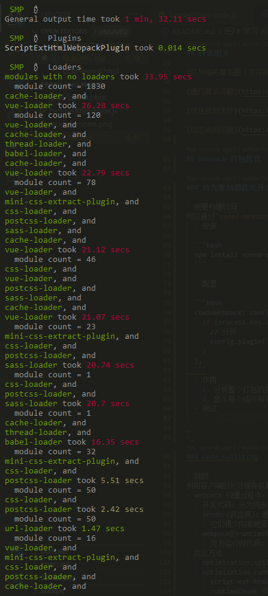
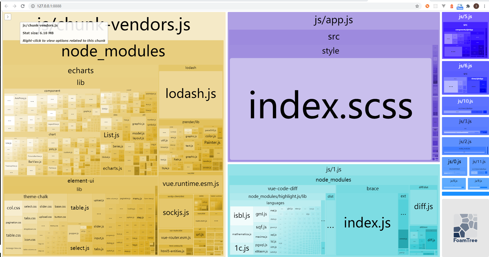

# Webpack 打包优化

## 首先要知道优化什么

- 测量构建时间
可以通过`speed-measure-webpack-plugin`插件来测量 webpack 构建期间各个阶段花费的时间。
  - 安装

    ```bash
    npm install speed-measure-webpack-plugin --save-dev
    ```

  - 配置

    ```bash
    const SpeedMeasurePlugin = require('speed-measure-webpack-plugin')
    const smp = new SpeedMeasurePlugin()
    configureWebpack: smp.wrap({
        ...
    })
    ```

  - 作用
    1. 分析整个打包的总耗时；
    2. 显示每个插件和loader的耗时情况
  - 测试
  

- 分析包内容
使用 webpack-bundle-analyzer 扫描 bundle 并构建其内部的可视化，查找大的或者比必要的依赖项。
  - 安装

    ```bash
    npm install webpack-bundle-analyzer --save-dev
    ```

  - 配置

    ```bash
    chainWebpack: config => {
        if (process.env.use_analyzer) {
        // 分析
        config.plugin('webpack-bundle-analyzer').use(require('webpack-bundle-analyzer').BundleAnalyzerPlugin)
        }
    },
    ```

  - 作用
    - 打包出的文件都包含什么
    - 每个文件的大小在总体中的占比
    - 模块间的包含关系
    - 是否有重复的依赖，是否存在同一个库在多个打包文件中重复
    - 是够有相似的依赖库
    - 每个文件依赖后的大小
  - 测试
  

## webpack 4 内置优化

- 内置的代码分割（mode = prod）
  - 新的 chunk 是否被共享或者都来自 node_modules 的模块
  - 新的 chunk 体积在压缩前是否大于 30kb
  - 按需加载的 chunk 的并发请求数量小于等于 5 个
  - 页面初始加载时的并发请求数量小于等于 3 个
满足以下条件的模块自动拆分出一个 chunk 来包含它.
- webpack 4 和 webpack 3 相比调整了什么（web 性能方面）
  - optimization.CommonsChunkPlugin -》 optimization.splitChunks（懒加载块拆分的优化）
  - splitChunks 和 CommonsChunkPlugin 区别
    - CommonsChunkPlugin的痛点在于将懒加载模块引入的公共模块统一抽取出来，这样可以避免懒加载模块间的代码重复，但只能统一抽取到父模块（入口文件），会造成父模块过大，不易于优化
    - SplitChunksPlugin 它能够抽取懒加载模块间的公共模块，并且不会抽到父级，而是会与首次用到的懒加载模块并行加载，解决了入口文件过大的问题。
  - 新增配置项
    - automaticNameDelimiter：修改连接块名的界定符
    - chunks： 表示选择哪些块进行优化，仅支持 initial, async, all
    - maxSize： 将分割块控制在 minSize 和 maxSize 之间，可以更好的利用http/2的长期缓存
    - 为 import 增加了对预取（Prefetch）和 预加载（Preload）的支持
    - 增加了对 [contenthash]的支持
    - 注意
      1. 按需加载块时并行请求数量将小于等于 6
      2. 初始页面加载时并行请求的最大数量将小于或等于 4

## 针对性优化

### 按需加载

- 第三方插件按需引入
如果第三方依赖支持后编译，使用后编译，且按需加载的方式使用第三方依赖，不要将组件库全量引入；
  - ECharts
  - lodash
  - element-ui
- 路由懒加载
把不同的路由对应的组件分割成不同的代码块，当路由被访问时才加载对应的组件，会大大提高首屏速度。

### Code splitting

- 目的
利用客户端的长效缓存机制来避免因为发布导致没有发生更改的第三方依赖被重复请求。
- webpack 构建过程中，分为三种类型的代码
  - 开发代码：分为同步模块（import ××× from ×××）和异步模块（import()）
  - vendor(供应商)：通过node_modules依赖的第三方代码
    - 它们很少向本地源代码那样频繁修改，如果单独抽成一个chunk，可以利用客户端的长效缓存机制，命中缓存来消除请求，减少网络请求中的耗时。
  - webpack的runtime代码：用于连接模块化应用程序所需的代码，可以抽成一个chunk并附加长效缓存机制
    - 何为运行时代码：形如import('abc').then(res=>{})这种异步加载的代码，在webpack中即为运行时代码。在VueCli工程中常见的异步加载路由即为runtime代码。
- 优化方法
  - optimization.splitChunks
  - optimization.runtimeChunk
    - script-ext-html-webpack-plugin（runtimeChunk文件很小，浏览器每次都需要重新请求它，它的 http 耗时远大于它的执行时间了，所以建议不要将它单独拆包，而是将它内联到我们的 index.html 之中。）
    - runtimeChunk 作用是为了线上更新版本时，充分利用浏览器缓存，使用户感知的影响到最低。

### 压缩

- 压缩工具
  - UglifyJsPlugin:通过封装 UglifyJS 实现压缩
  - ParallelUglifyPlugin： 多进程并行处理压缩
- 压缩 JS
UglifyJsPlugin/ParallelUglifyPlugin：
- 压缩 CSS
optimize-css-assets-webpack-plugin：在 webpack 构建过程中搜索、优化、最小化 CSS
- 提取 CSS
使用 webpack 打包时，通常会将 css 提取到单独的 css 样式文件中，不再内联到 JS 包中，这样在项目运行时，速度会更快，因为 css 包和 JS 包是并行加载的。
  - 使用插件：mini-css-extract-plugin（webpack 4）
- 开启 gzip 压缩

### 衡量优化前后对项目的影响
